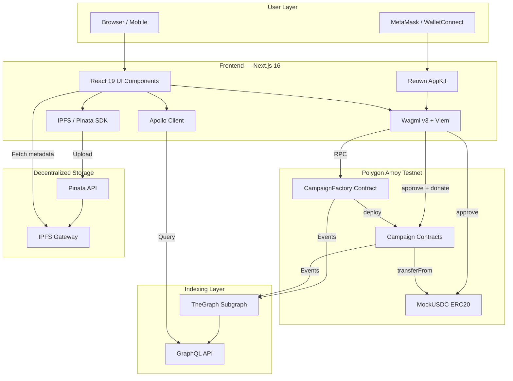
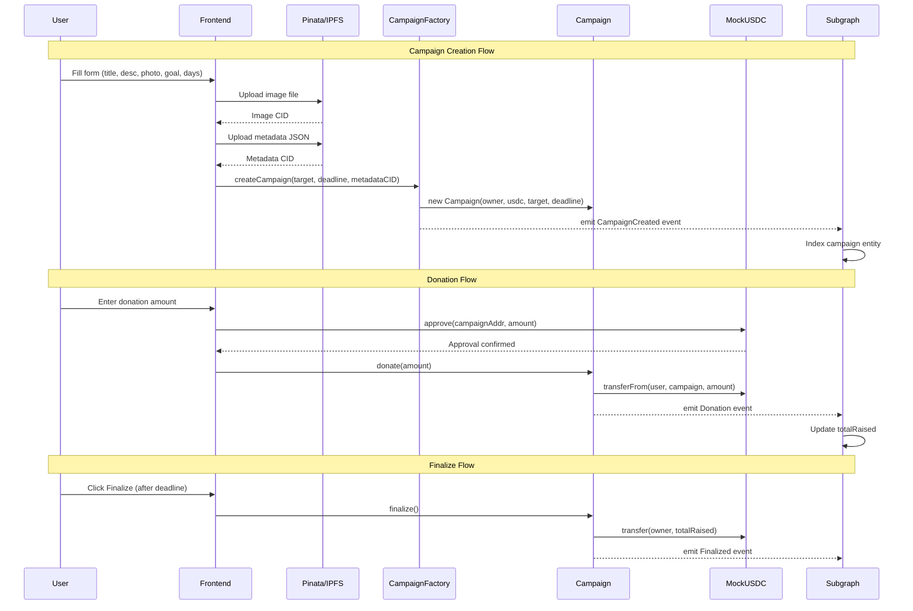
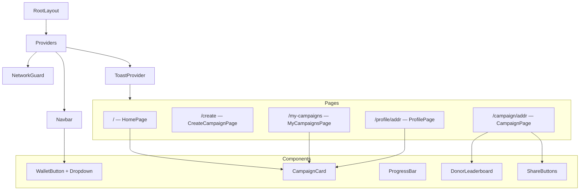
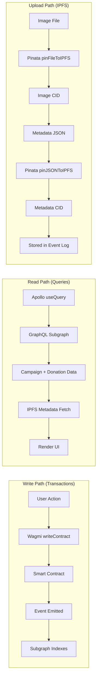

# FundChain — Technical Documentation

> Decentralized fundraising platform on Polygon Amoy powered by USDC, IPFS, and TheGraph.

---

## Table of Contents

1. [Overview](#1-overview)
2. [Architecture](#2-architecture)
3. [Technology Stack](#3-technology-stack)
4. [Smart Contracts](#4-smart-contracts)
5. [Subgraph (Indexing Layer)](#5-subgraph-indexing-layer)
6. [Frontend Application](#6-frontend-application)
7. [Data Flows](#7-data-flows)
8. [Environment Configuration](#8-environment-configuration)
9. [Deployment](#9-deployment)
10. [Project Structure](#10-project-structure)

---

## 1. Overview

**FundChain** is a fully decentralized crowdfunding platform where users can create fundraising campaigns, donate USDC tokens, and track progress in real-time. All campaign data lives on the Polygon Amoy blockchain, metadata is stored on IPFS via Pinata, and a TheGraph subgraph indexes events for fast querying.

### Key Features

| Feature | Description |
|---|---|
| Campaign Creation | Deploy a smart contract per campaign with target amount, deadline, and IPFS metadata |
| USDC Donations | Two-step approve + donate flow using ERC20 SafeTransfer |
| Real-time Tracking | Auto-refreshing progress bars via GraphQL polling (10s interval) |
| Wallet Connection | WalletConnect QR code for mobile + injected wallets via Reown AppKit |
| IPFS Metadata | Campaign title, description, and hero image stored on IPFS via Pinata |
| Donor Leaderboard | Top donors ranked by total contribution per campaign |
| Profile System | Per-address statistics: donations made, campaigns created, USDC raised |
| Search & Filter | Client-side search by title, filter by status (Live/Ended), sort options |
| Network Guard | Automatic detection of wrong network with one-click switch |
| Responsive UI | Mobile-first dark theme with burger menu and slide-out drawer |

---

## 2. Architecture

### 2.1 System Architecture Diagram



### 2.2 Architecture Layers

| Layer | Technology | Responsibility |
|---|---|---|
| **Presentation** | Next.js 16, React 19, CSS | UI rendering, routing, responsive design |
| **Web3 Integration** | Wagmi v3, Viem, Reown AppKit | Wallet connection, contract calls, transaction signing |
| **Data Querying** | Apollo Client, TheGraph | GraphQL queries for campaign/donation data |
| **Storage** | IPFS, Pinata | Campaign metadata (title, description, images) |
| **Smart Contracts** | Solidity 0.8.20, OpenZeppelin | On-chain business logic, fund management |
| **Indexing** | TheGraph, AssemblyScript | Event indexing, derived data aggregation |

---

## 3. Technology Stack

### 3.1 Frontend

| Technology | Version | Purpose |
|---|---|---|
| **Next.js** | 16.0.10 | React framework with App Router, SSR, Turbopack |
| **React** | 19.2.1 | UI component library |
| **TypeScript** | 5.x | Type-safe development |
| **Wagmi** | 3.1.4 | React hooks for Ethereum (useAccount, useWriteContract, etc.) |
| **Viem** | 2.43.5 | Low-level Ethereum interactions, ABI encoding |
| **@reown/appkit** | 1.8.19 | Wallet connection modal with QR code support |
| **@reown/appkit-adapter-wagmi** | 1.8.19 | Bridge between AppKit and Wagmi |
| **@apollo/client** | 3.14.0 | GraphQL client with caching |
| **@tanstack/react-query** | 5.90.16 | Async state management (required by Wagmi) |
| **graphql** | 16.12.0 | GraphQL schema and query language |

### 3.2 Smart Contracts

| Technology | Version | Purpose |
|---|---|---|
| **Solidity** | 0.8.20 | Smart contract language |
| **OpenZeppelin** | 5.x | SafeERC20, ReentrancyGuard, ERC20 base |
| **Foundry (Forge)** | 1.5.0 | Compilation, testing, deployment |

### 3.3 Subgraph

| Technology | Version | Purpose |
|---|---|---|
| **TheGraph** | Hosted (Studio) | Decentralized indexing protocol |
| **@graphprotocol/graph-ts** | 0.38.2 | AssemblyScript bindings for mapping handlers |
| **AssemblyScript** | — | Event handler language compiled to WASM |

### 3.4 Infrastructure

| Service | Purpose |
|---|---|
| **Polygon Amoy** | EVM-compatible testnet (chain ID: 80002) |
| **Pinata** | IPFS pinning service for metadata storage |
| **IPFS Gateway** (`ipfs.io`) | Public HTTP gateway for reading IPFS content |
| **Reown Cloud** | WalletConnect relay and project management |
| **Railway** | Frontend deployment platform |
| **TheGraph Studio** | Subgraph deployment and management |

---

## 4. Smart Contracts

### 4.1 Contract Interaction Diagram



### 4.2 CampaignFactory.sol

**Address:** `0x9E02129932dEcC5C6a9C68a06e29c7a082ab091d`

Factory contract responsible for deploying individual Campaign contracts.

```solidity
contract CampaignFactory {
    address public immutable usdc;
    mapping(address => address) public campaignOf;

    event CampaignCreated(
        address indexed owner,
        address indexed campaign,
        uint256 targetAmount,
        uint256 deadline,
        string metadataCID
    );

    constructor(address _usdc);
    function createCampaign(
        uint256 targetAmount,
        uint256 deadline,
        string calldata metadataCID
    ) external returns (address);
}
```

**Key Design Decisions:**
- `metadataCID` is stored in the event log (not in contract storage) to save gas — the subgraph indexes it
- `campaignOf` maps each creator to their **latest** campaign address
- No restriction on number of campaigns per wallet (removed for flexibility)

### 4.3 Campaign.sol

Individual campaign contract deployed by the factory.

```solidity
contract Campaign is ReentrancyGuard {
    IERC20 public immutable usdc;
    address public immutable owner;
    uint256 public immutable targetAmount;
    uint256 public immutable deadline;
    uint256 public totalRaised;
    bool public finalized;

    event Donation(address indexed from, uint256 amount, uint256 totalRaised);
    event Finalized(uint256 totalRaised);

    constructor(address _owner, address _usdc, uint256 _targetAmount, uint256 _deadline);
    function donate(uint256 amount) external nonReentrant;
    function finalize() external nonReentrant;
}
```

**Security Measures:**
- `ReentrancyGuard` prevents re-entrancy attacks on `donate()` and `finalize()`
- `SafeERC20` wraps all token transfers to handle non-standard ERC20 implementations
- `require(block.timestamp < deadline)` enforces donation time window
- `require(!finalized)` prevents double finalization
- Only `owner` can call `finalize()`

**Donation Flow:**
1. User calls `approve(campaignAddress, amount)` on USDC contract
2. User calls `donate(amount)` on Campaign contract
3. Campaign executes `safeTransferFrom(msg.sender, address(this), amount)`
4. `totalRaised` is updated and `Donation` event is emitted

**Finalization Flow:**
1. After deadline passes, owner calls `finalize()`
2. All collected USDC is transferred to owner via `safeTransfer`
3. `finalized = true` prevents further operations

### 4.4 MockUSDC.sol

Test ERC20 token for development.

```solidity
contract MockUSDC is ERC20 {
    constructor() ERC20("Mock USDC", "USDC") {}
    function decimals() public pure override returns (uint8) { return 6; }
    function mint(address to, uint256 amount) external { _mint(to, amount); }
}
```

**Address:** `0xEf04D0421E99c1Cf9566bAE347F97DD81B34375F`

- 6 decimals (matches real USDC)
- Public `mint()` function for testing — any address can mint tokens
- To mint 1000 USDC: `mint(address, 1000000000)` (1000 * 10^6)

### 4.5 Deployed Contract Addresses

| Contract | Address | Network |
|---|---|---|
| CampaignFactory | `0x9E02129932dEcC5C6a9C68a06e29c7a082ab091d` | Polygon Amoy |
| MockUSDC | `0xEf04D0421E99c1Cf9566bAE347F97DD81B34375F` | Polygon Amoy |

---

## 5. Subgraph (Indexing Layer)

### 5.1 Overview

TheGraph subgraph listens to on-chain events and builds a queryable GraphQL API. It uses a **data source template** pattern: the factory creates a new data source for each deployed campaign.

**Endpoint:** `https://api.studio.thegraph.com/query/1721285/campaign/v0.0.3`

### 5.2 Schema (schema.graphql)

```graphql
type Campaign @entity {
  id: ID!                    # Campaign contract address
  owner: Bytes!              # Creator wallet address
  targetAmount: BigInt!      # Goal in USDC (6 decimals)
  deadline: BigInt!          # Unix timestamp
  metadataCID: String!       # IPFS CID for metadata JSON
  createdAtBlock: BigInt!    # Block number at creation
  totalRaised: BigInt!       # Running total of donations
  donations: [Donation!]! @derivedFrom(field: "campaign")
}

type Donation @entity(immutable: true) {
  id: ID!                    # txHash-logIndex
  campaign: Campaign!        # Reference to parent campaign
  from: Bytes!               # Donor address
  amount: BigInt!            # Amount in USDC (6 decimals)
  blockNumber: BigInt!       # Block of donation tx
  timestamp: BigInt!         # Unix timestamp
  txHash: Bytes!             # Transaction hash
}
```

**Design Notes:**
- `Donation` is marked `immutable: true` — once created, it never changes, enabling storage optimizations
- `donations` on Campaign is a derived field (`@derivedFrom`) — no storage cost, computed from Donation entities
- `totalRaised` is updated incrementally in the handler (not recalculated)

### 5.3 Event Handlers

#### mapping.ts — Factory Handler

```typescript
export function handleCampaignCreated(event: CampaignCreated): void {
  let campaign = new Campaign(event.params.campaign.toHexString());
  campaign.owner = event.params.owner;
  campaign.targetAmount = event.params.targetAmount;
  campaign.deadline = event.params.deadline;
  campaign.metadataCID = event.params.metadataCID;
  campaign.createdAtBlock = event.block.number;
  campaign.totalRaised = BigInt.fromI32(0);
  campaign.save();

  // Create dynamic data source for this campaign's events
  CampaignTemplate.create(event.params.campaign);
}
```

#### campaign.ts — Donation Handler

```typescript
export function handleDonation(event: DonationEvent): void {
  let id = event.transaction.hash.toHexString() + "-" + event.logIndex.toString();
  let donation = new Donation(id);
  donation.campaign = event.address.toHexString();
  donation.from = event.params.from;
  donation.amount = event.params.amount;
  donation.blockNumber = event.block.number;
  donation.timestamp = event.block.timestamp;
  donation.txHash = event.transaction.hash;
  donation.save();

  // Update campaign total
  let campaign = Campaign.load(event.address.toHexString());
  if (campaign) {
    campaign.totalRaised = campaign.totalRaised.plus(event.params.amount);
    campaign.save();
  }
}
```

### 5.4 Data Source Configuration (subgraph.yaml)

```yaml
dataSources:
  - kind: ethereum
    name: CampaignFactory
    network: polygon-amoy
    source:
      address: "0x9E02129932dEcC5C6a9C68a06e29c7a082ab091d"
      startBlock: 35924601
    mapping:
      eventHandlers:
        - event: CampaignCreated(indexed address,indexed address,uint256,uint256,string)
          handler: handleCampaignCreated

templates:
  - kind: ethereum
    name: Campaign
    network: polygon-amoy
    source:
      abi: Campaign
    mapping:
      eventHandlers:
        - event: Donation(indexed address,uint256,uint256)
          handler: handleDonation
```

### 5.5 GraphQL Queries Used by Frontend

```graphql
# All campaigns (homepage)
query GetCampaigns {
  campaigns(first: 100, orderBy: createdAtBlock, orderDirection: desc) {
    id, owner, targetAmount, totalRaised, deadline, metadataCID, createdAtBlock
  }
}

# Single campaign with donations (detail page)
query GetCampaign($id: ID!) {
  campaign(id: $id) {
    id, owner, targetAmount, totalRaised, deadline, metadataCID, createdAtBlock
    donations(orderBy: timestamp, orderDirection: desc) {
      id, from, amount, timestamp, txHash
    }
  }
}

# Campaigns by owner (profile/my-campaigns)
query GetMyCampaigns($owner: String!) {
  campaigns(where: { owner: $owner }, orderBy: createdAtBlock, orderDirection: desc) {
    id, owner, targetAmount, totalRaised, deadline, metadataCID, createdAtBlock
  }
}

# Donations by address (profile/my-campaigns)
query GetMyDonations($from: String!) {
  donations(where: { from: $from }, orderBy: timestamp, orderDirection: desc) {
    id, from, amount, timestamp, txHash
    campaign { id, owner, targetAmount, totalRaised, deadline, metadataCID, createdAtBlock }
  }
}
```

---

## 6. Frontend Application

### 6.1 Component Architecture



### 6.2 Provider Hierarchy

The app wraps all content in a provider chain defined in `app/providers.tsx`:

```
WagmiProvider          ← Blockchain state & hooks
  └─ QueryClientProvider  ← React Query (async cache, required by Wagmi)
       └─ ApolloProvider     ← GraphQL client for subgraph queries
            └─ ToastProvider     ← Global notification system
                 └─ {children}      ← App pages
```

AppKit is initialized at module level via `import "@/lib/appkit"` at the top of providers.tsx.

### 6.3 Pages

#### `/` — HomePage

| Aspect | Detail |
|---|---|
| **Data Source** | `GET_CAMPAIGNS` via Apollo |
| **Features** | Search bar, filter (All/Live/Ended), sort (Newest/Most Funded/Ending Soon) |
| **Metadata** | Fetched in parallel for all campaigns, stored in `metaMap` state |
| **Filtering** | Client-side filtering on already-fetched data |
| **Components** | CampaignCard, ProgressBar |

#### `/create` — CreateCampaignPage

| Aspect | Detail |
|---|---|
| **Auth** | Requires wallet connection (shows "Wallet not connected" if not) |
| **Steps** | 1. Upload image → 2. Upload metadata JSON → 3. Deploy contract |
| **Progress** | Visual progress bar with step labels (33% / 66% / 90% / 100%) |
| **Contract Call** | `CampaignFactory.createCampaign(targetAmount, deadline, metadataCID)` |
| **Target Encoding** | `BigInt(Number(target) * 1e6)` — converts USDC to 6-decimal integer |
| **Deadline** | `Math.floor(Date.now() / 1000) + Number(days) * 86400` |

#### `/campaign/[address]` — CampaignPage

| Aspect | Detail |
|---|---|
| **Data Source** | `GET_CAMPAIGN` with `pollInterval: 10000` (10s auto-refresh) |
| **Sections** | Hero image, description, stats, progress bar, donate form, donation history, leaderboard, share buttons |
| **Donate** | Uses `useDonate` hook (approve + donate), calls `refetch()` after success |
| **Leaderboard** | Aggregates donations by address, sorts by total, shows top 10 with medal emojis |
| **Share** | Copy Link (clipboard API) + Share on X (Twitter intent URL) |

#### `/my-campaigns` — MyCampaignsPage

| Aspect | Detail |
|---|---|
| **Auth** | Requires wallet connection |
| **Queries** | `GET_MY_CAMPAIGNS` + `GET_MY_DONATIONS` filtered by connected address |
| **Tabs** | "Created" (campaigns owned by user) / "Donated" (campaigns user donated to) |
| **Donated Tab** | Deduplicates campaigns + shows chronological donation history |

#### `/profile/[address]` — ProfilePage

| Aspect | Detail |
|---|---|
| **Public** | No wallet connection required — any address can be viewed |
| **Stats** | USDC Donated, USDC Raised, Projects Supported, Campaigns Created |
| **Avatar** | Generated gradient from first 12 hex chars of address |
| **Sections** | Created campaigns grid, Supported projects grid (with "You: X USDC" badge), Donation history |
| **Links** | Polygonscan explorer link |

### 6.4 Core Libraries

#### `lib/wagmi.ts` — Web3 Configuration

```typescript
// Wagmi adapter for Polygon Amoy
const wagmiAdapter = new WagmiAdapter({
  projectId,            // WalletConnect project ID
  networks: [polygonAmoy],
  transports: {
    [polygonAmoy.id]: http(process.env.NEXT_PUBLIC_AMOY_RPC),
  },
  storage: createStorage({ storage: cookieStorage }),
  ssr: true,
});

// AppKit singleton for wallet modal
export function getAppKit() {
  if (!appKitInstance) {
    appKitInstance = createAppKit({
      adapters: [wagmiAdapter],
      projectId,
      networks: [polygonAmoy],
      metadata: { name: "FundChain", ... },
    });
  }
  return appKitInstance;
}
```

**Why Reown AppKit?** Unlike raw WalletConnect connectors, AppKit provides a complete modal UI with QR code scanning, multiple wallet options, and mobile deep linking out of the box.

#### `lib/apolloClient.ts` — GraphQL Client

```typescript
export const apolloClient = new ApolloClient({
  link: new HttpLink({ uri: process.env.NEXT_PUBLIC_GRAPH_URL }),
  cache: new InMemoryCache(),
});
```

#### `lib/ipfs.ts` — IPFS/Pinata Integration

| Function | Input | Output | Description |
|---|---|---|---|
| `ipfsToHttp(uri)` | `"ipfs://Qm..."` | `"https://ipfs.io/ipfs/Qm..."` | Convert IPFS URI for `` |
| `uploadFileToPinata(file)` | `File` object | CID string | Upload image, returns IPFS hash |
| `uploadJsonToPinata(data)` | `CampaignMetadata` | CID string | Upload JSON metadata |
| `fetchMetadata(cid)` | CID string | `CampaignMetadata \| null` | Fetch with 8s timeout |

**Metadata JSON structure stored on IPFS:**
```json
{
  "title": "Campaign Title",
  "description": "Campaign description text",
  "image": "ipfs://bafkreiXXX..."
}
```

#### `lib/errors.ts` — Error Classification

Centralized error parser that converts raw blockchain/network errors into user-friendly messages.

| Category | Trigger Pattern | User Message |
|---|---|---|
| `user-rejected` | "User rejected", "denied" | *(silently dismissed)* |
| `already-exists` | "Already exists" | "A campaign already exists for this wallet" |
| `wrong-network` | "chain", "network" | "Please switch to Polygon Amoy" |
| `no-funds` | "insufficient", "exceeds balance" | "Not enough funds in your wallet" |
| `pinata-auth` | "401", "403" from Pinata | "Pinata JWT is invalid or expired" |
| `pinata-limit` | "429" from Pinata | "Pinata rate limit reached" |
| `pinata-size` | "413" from Pinata | "File is too large" |
| `ipfs-upload` | "Pinata" in message | "IPFS upload failed" |
| `network` | "network", "fetch" | "Network error — check your connection" |
| `timeout` | "timeout", "aborted" | "Request timed out" |
| `unknown` | *(default)* | Raw error message |

### 6.5 Custom Hooks

#### `hooks/useDonate.ts`

```typescript
export function useDonate(campaignAddress: `0x${string}`) {
  const { writeContractAsync } = useWriteContract();
  const { address } = useAccount();

  async function donate(amount: number) {
    const raw = BigInt(Math.round(amount * 1e6));
    // Step 1: Approve USDC spending
    await writeContractAsync({
      address: USDC, abi: ERC20Abi.abi,
      functionName: "approve",
      args: [campaignAddress, raw],
    });
    // Step 2: Execute donation
    await writeContractAsync({
      address: campaignAddress, abi: CampaignAbi.abi,
      functionName: "donate",
      args: [raw],
    });
  }
  return { donate };
}
```

### 6.6 Components

#### `Navbar.tsx`

- **Desktop:** Logo + nav links (Campaigns, My Campaigns, + Create) + WalletButton
- **Mobile (< 768px):** Logo + WalletButton + burger icon → slide-out drawer
- Active route highlighting via `usePathname()`
- Menu auto-closes on route change and locks body scroll

#### `WalletButton.tsx`

- **Disconnected:** Purple gradient "Connect Wallet" button → opens AppKit modal
- **Connected:** Shows shortened address with dropdown menu:
  - Profile link (`/profile/[address]`)
  - My Campaigns link
  - Disconnect button
- Outside-click closes dropdown

#### `NetworkGuard.tsx`

- Uses `useChainId()` to detect current network
- If connected but not on Polygon Amoy (80002): shows amber fixed banner
- "Switch Network" button calls `switchChain({ chainId: 80002 })`
- Banner pushes page content down via `body:has(.network-banner)` CSS

#### `Toast.tsx`

- React Context-based notification system
- `useToast()` returns `toast(type, message)` function
- Types: `success` (green), `error` (red), `info` (blue)
- Auto-dismiss after 5 seconds
- Stacks multiple toasts with slide-in animation

### 6.7 Styling System

**Design Tokens (CSS Custom Properties):**

```css
--bg-base:        #07080f       /* Page background */
--bg-card:        rgba(255,255,255,0.035)
--bg-nav:         rgba(7,8,15,0.85)
--text-primary:   #f1f5f9
--text-secondary: #94a3b8
--text-muted:     #475569
--purple:         #8b5cf6       /* Primary accent */
--blue:           #3b82f6
--cyan:           #22d3ee
--green:          #10b981       /* Success / Live */
--red:            #f43f5e       /* Danger / Error */
--grad-primary:   linear-gradient(135deg, #8b5cf6, #3b82f6)
--font-sans:      'Space Grotesk', 'Inter', system-ui
--font-mono:      'Space Mono', 'Courier New', monospace
```

**Responsive Breakpoints:**

| Breakpoint | Behavior |
|---|---|
| `> 768px` | Desktop layout, full navbar, 2-column campaign grid |
| `<= 768px` | Burger menu, single-column grid, smaller padding |
| `<= 600px` | Stacked filters, full-width sort dropdown |
| `<= 480px` | Full-width toasts, stacked profile header |

---

## 7. Data Flows

### 7.1 Data Flow Diagram



### 7.2 Campaign Creation (detailed)

1. User fills form: title, description, photo (optional), target USDC, duration in days
2. **Image upload:** `POST /pinning/pinFileToIPFS` → returns image CID
3. **Metadata upload:** `POST /pinning/pinJSONToIPFS` with `{ title, description, image: "ipfs://CID" }` → returns metadata CID
4. **Contract call:** `createCampaign(targetAmount * 1e6, deadline_unix, metadataCID)`
5. Factory deploys new Campaign contract and emits `CampaignCreated` event
6. Subgraph handler creates `Campaign` entity and starts tracking the new contract
7. Frontend shows success with transaction hash

### 7.3 Donation (detailed)

1. User enters USDC amount on campaign detail page
2. **Approve:** `USDC.approve(campaignAddress, amount * 1e6)` — user signs in wallet
3. **Donate:** `Campaign.donate(amount * 1e6)` — user signs second transaction
4. Campaign contract calls `safeTransferFrom` to pull USDC from user
5. `Donation` event emitted with amount and updated total
6. Subgraph creates `Donation` entity and updates `Campaign.totalRaised`
7. Frontend calls `refetch()` + polls every 10s for updated data

### 7.4 Data Reading

1. `useQuery(GET_CAMPAIGNS)` fetches all campaigns from subgraph
2. For each campaign, `fetchMetadata(metadataCID)` loads title/description/image from IPFS
3. Metadata is cached in component state (`metaMap`) to avoid refetching
4. IPFS fetch has 8-second timeout — returns `null` on failure (graceful degradation)

---

## 8. Environment Configuration

### 8.1 Frontend (.env.local)

```env
# Subgraph GraphQL endpoint
NEXT_PUBLIC_GRAPH_URL=https://api.studio.thegraph.com/query/1721285/campaign/v0.0.3

# Polygon Amoy RPC
NEXT_PUBLIC_AMOY_RPC=https://rpc-amoy.polygon.technology

# Smart contract addresses
NEXT_PUBLIC_FACTORY=0x9E02129932dEcC5C6a9C68a06e29c7a082ab091d
NEXT_PUBLIC_USDC=0xEf04D0421E99c1Cf9566bAE347F97DD81B34375F

# Pinata JWT for IPFS uploads
NEXT_PUBLIC_PINATA_JWT=<your-pinata-jwt>

# WalletConnect / Reown project ID
NEXT_PUBLIC_WC_PROJECT_ID=<your-project-id>
```

### 8.2 Contracts (.env)

```env
AMOY_RPC=https://rpc-amoy.polygon.technology
DEPLOYER_KEY=0x<private-key>
MOCK_USDC=0xEf04D0421E99c1Cf9566bAE347F97DD81B34375F
FACTORY=0x9E02129932dEcC5C6a9C68a06e29c7a082ab091d
```

### 8.3 External Service Setup

| Service | Setup URL | What You Need |
|---|---|---|
| **Pinata** | https://app.pinata.cloud/developers/api-keys | JWT token for IPFS uploads |
| **Reown Cloud** | https://cloud.reown.com | Project ID + whitelisted domains |
| **TheGraph Studio** | https://thegraph.com/studio | Deploy key for subgraph updates |
| **Polygon Amoy** | https://faucet.polygon.technology | Test POL for gas |

---

## 9. Deployment

### 9.1 Smart Contracts (Foundry)

```bash
cd contracts

# Build
forge build

# Deploy MockUSDC
cast send --create $(forge inspect MockUSDC bytecode) \
  --rpc-url https://rpc-amoy.polygon.technology \
  --private-key $DEPLOYER_KEY

# Deploy CampaignFactory (pass MockUSDC address as constructor arg)
BYTECODE=$(forge inspect CampaignFactory bytecode)
ARGS=$(cast abi-encode "constructor(address)" $MOCK_USDC)
cast send --rpc-url https://rpc-amoy.polygon.technology \
  --private-key $DEPLOYER_KEY \
  --create "${BYTECODE}${ARGS:2}"
```

### 9.2 Subgraph (TheGraph Studio)

```bash
cd subgraph

# Update subgraph.yaml with new factory address and startBlock
# Then:
graph codegen
graph build
graph deploy campaign \
  --node https://api.studio.thegraph.com/deploy/ \
  --version-label v0.0.3
```

### 9.3 Frontend (Railway)

1. Connect GitHub repository to Railway
2. Set **Root Directory** to `frontend`
3. Add all `NEXT_PUBLIC_*` environment variables
4. Railway auto-detects Next.js and runs `npm run build` + `npm start`

**Required Railway Variables:**

| Variable | Value |
|---|---|
| `NEXT_PUBLIC_GRAPH_URL` | TheGraph Studio query URL |
| `NEXT_PUBLIC_AMOY_RPC` | `https://rpc-amoy.polygon.technology` |
| `NEXT_PUBLIC_FACTORY` | Factory contract address |
| `NEXT_PUBLIC_USDC` | MockUSDC contract address |
| `NEXT_PUBLIC_PINATA_JWT` | Pinata API JWT |
| `NEXT_PUBLIC_WC_PROJECT_ID` | Reown/WalletConnect project ID |

---

## 10. Project Structure

```
fundraising-platform/
├── contracts/                    # Solidity smart contracts
│   ├── src/
│   │   ├── Campaign.sol          # Individual campaign contract
│   │   ├── CampaignFactory.sol   # Factory for deploying campaigns
│   │   └── MockUSDC.sol          # Test ERC20 token (6 decimals)
│   ├── lib/
│   │   └── openzeppelin-contracts/  # OpenZeppelin dependency
│   ├── foundry.toml              # Foundry configuration
│   └── .env                      # Deployer private key & addresses
│
├── subgraph/                     # TheGraph indexing
│   ├── schema.graphql            # Campaign + Donation entities
│   ├── subgraph.yaml             # Data sources & event handlers config
│   ├── src/
│   │   ├── mapping.ts            # CampaignCreated handler
│   │   └── campaign.ts           # Donation handler
│   ├── abis/
│   │   ├── CampaignFactory.json
│   │   └── Campaign.json
│   └── package.json
│
├── frontend/                     # Next.js application
│   ├── app/
│   │   ├── layout.tsx            # Root layout (Providers + Navbar + NetworkGuard)
│   │   ├── providers.tsx         # Wagmi + React Query + Apollo + Toast providers
│   │   ├── globals.css           # Complete design system (~1400 lines)
│   │   ├── page.tsx              # Homepage — campaign grid with search/filter
│   │   ├── create/
│   │   │   └── page.tsx          # Campaign creation form
│   │   ├── campaign/
│   │   │   └── [address]/
│   │   │       └── page.tsx      # Campaign detail + donate + leaderboard
│   │   ├── my-campaigns/
│   │   │   └── page.tsx          # User's campaigns & donation history
│   │   └── profile/
│   │       └── [address]/
│   │           └── page.tsx      # Wallet profile with stats
│   │
│   ├── components/
│   │   ├── Navbar.tsx            # Navigation with burger menu
│   │   ├── WalletButton.tsx      # Wallet connection + dropdown menu
│   │   ├── NetworkGuard.tsx      # Wrong network warning banner
│   │   └── Toast.tsx             # Toast notification system
│   │
│   ├── lib/
│   │   ├── wagmi.ts              # Wagmi + AppKit configuration
│   │   ├── appkit.ts             # AppKit eager initialization
│   │   ├── apolloClient.ts       # Apollo GraphQL client
│   │   ├── queries.ts            # GraphQL query definitions
│   │   ├── ipfs.ts               # IPFS upload/fetch via Pinata
│   │   └── errors.ts             # Centralized error parser
│   │
│   ├── hooks/
│   │   └── useDonate.ts          # Approve + donate transaction hook
│   │
│   ├── abi/
│   │   ├── CampaignFactory.json  # Factory ABI
│   │   ├── Campaign.json         # Campaign ABI
│   │   └── MockUSDC.json         # ERC20 ABI
│   │
│   ├── .env.local                # Environment variables
│   ├── package.json              # Dependencies
│   └── tsconfig.json             # TypeScript config
│
└── DOCUMENTATION.md              # This file
```

---

## Appendix A: Network Configuration

### Polygon Amoy Testnet

| Property | Value |
|---|---|
| Chain ID | `80002` |
| Currency Symbol | `POL` |
| RPC URL | `https://rpc-amoy.polygon.technology` |
| Block Explorer | `https://amoy.polygonscan.com` |
| Faucet (POL) | `https://faucet.polygon.technology` |
| Faucet (USDC) | `https://faucet.circle.com` |

### Adding to MetaMask Manually

MetaMask → Settings → Networks → Add Network → Add manually:
- Network Name: `Polygon Amoy Testnet`
- New RPC URL: `https://rpc-amoy.polygon.technology`
- Chain ID: `80002`
- Currency Symbol: `POL`
- Block Explorer URL: `https://amoy.polygonscan.com`

---

## Appendix B: USDC Amount Encoding

All USDC amounts on-chain use **6 decimal places** (matching real USDC):

| Human-readable | On-chain value | Conversion |
|---|---|---|
| 1 USDC | `1000000` | `amount * 1e6` |
| 100 USDC | `100000000` | `amount * 1e6` |
| 0.50 USDC | `500000` | `amount * 1e6` |

**Frontend encoding:** `BigInt(Math.round(amount * 1e6))`
**Frontend decoding:** `Number(value) / 1e6`

---

## Appendix C: Security Considerations

| Risk | Mitigation |
|---|---|
| Reentrancy attack | `ReentrancyGuard` on `donate()` and `finalize()` |
| Token transfer failure | `SafeERC20` wraps all transfer calls |
| Donation after deadline | `require(block.timestamp < deadline)` |
| Double finalization | `require(!finalized)` check |
| Unauthorized finalization | `require(msg.sender == owner)` |
| IPFS fetch hang | 8-second `AbortController` timeout |
| Wrong network | `NetworkGuard` component with auto-switch |
| Private key exposure | Environment variables, never committed to git |

---

*Generated for FundChain v1.0 — Polygon Amoy Testnet*
